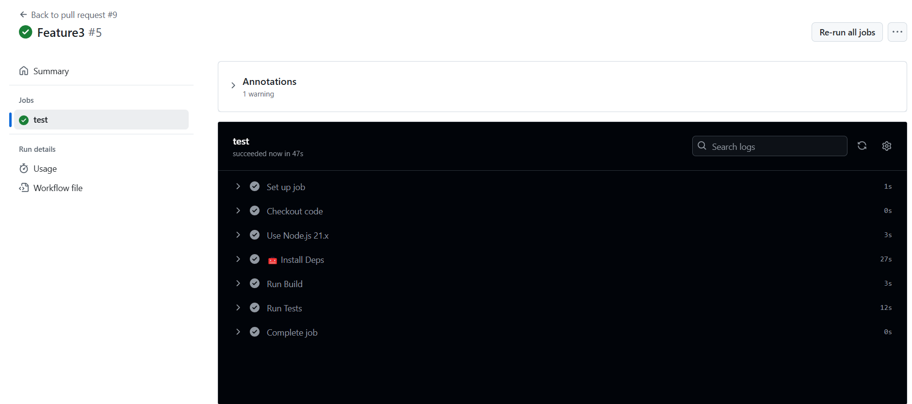
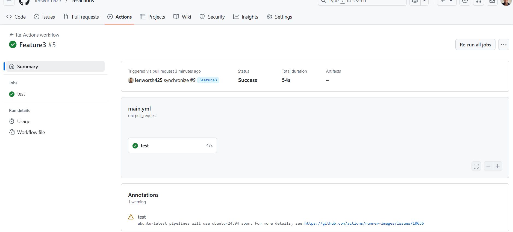

# re-actions

## Basic Overview
Re-Actions is a application that utilizes the GitHub Action to ensure that certain quality checks are met prior to merging to important branches such as main. Before the project code was added, a CI/CD pipeline using GitHub Actions was created to run the component tests via Cypress when a Pull Request is made to the develop branch, and the application is deployed when code is merged from develop to the main branch.

## Walkthrough
The screenschots below will show you the mock-up of the GitHub Action.

### Screenshots

GitHub Action

Test Page

### Link
Deployed URL:

[Link](https://re-actions.onrender.com)

## Contribution
No monetay contribution but will always accept critics and improvement options 

## Future Development
For future development, the app will need to show the following day tin the 5-day forecast and not the current day.

##
Note: I received help from BCS Learning assistant (to clarify my errors) and tutors. 

© 2024 lenworth425 Confidential and Proprietary. All Rights Reserved.